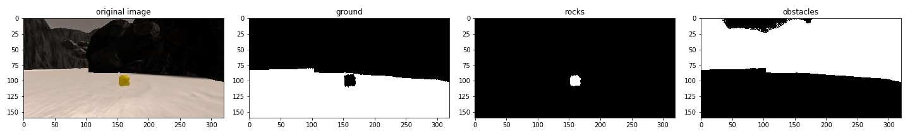

# Rover Project


**The goals / steps of this project are the following:**  

**Training / Calibration**  

* Download the simulator and take data in "Training Mode"
* Test out the functions in the Jupyter Notebook provided
* Add functions to detect obstacles and samples of interest (golden rocks)
* Fill in the `process_image()` function with the appropriate image processing steps (perspective transform, color threshold etc.) to get from raw images to a map.  The `output_image` you create in this step should demonstrate that your mapping pipeline works.
* Use `moviepy` to process the images in your saved dataset with the `process_image()` function.  Include the video you produce as part of your submission.

**Autonomous Navigation / Mapping**

* Fill in the `perception_step()` function within the `perception.py` script with the appropriate image processing functions to create a map and update `Rover()` data (similar to what you did with `process_image()` in the notebook).
* Fill in the `decision_step()` function within the `decision.py` script with conditional statements that take into consideration the outputs of the `perception_step()` in deciding how to issue throttle, brake and steering commands.
* Iterate on your perception and decision function until your rover does a reasonable (need to define metric) job of navigating and mapping.  

### Notebook Analysis

#### 1. how I identified ground, obstacles and rocks

I used color thresholding with the following threshold..

```
ground:
 - thresh = (R_channel > 160) & (G_channel > 160) & (B_channel > 140)
obstacles:
 - thresh = (R_channel < 110) & (G_channel < 110) & (B_channel < 130)
rock:
 - thresh = (R_channel > 100) & (G_channel > 100) & (B_channel < 60)
```



#### 2. how I modified `process_image()`

pipeline is the following ..

1. define `src` and `dst` coordinates using a calibration image


2. apply perspective transform

```
M = cv2.getPerspectiveTransform(src, dst)
warped = cv2.warpPerspective(img, M, (img.shape[1], img.shape[0]))
```

3. apply color thresolding

4. convert thresholded image pixel values to rover-centric coords

5. convert rover-centric pixel values to world coords

(rotation + translation) to worldmap

6. update worldmap

7. make a combined image w/ ground_truth map

```
cv2.addWeighted(data.worldmap, 1, data.ground_truth, 0.1, 0)
```

#### 3. I created [video]('./output/test_mapping.mp4') using moviepy

---

### Autonomous Navigation and Mapping

#### 1. Fill in the `perception_step()` (at the bottom of the `perception.py` script) and `decision_step()` (in `decision.py`) functions in the autonomous mapping scripts and an explanation is provided in the writeup of how and why these functions were modified as they were.


#### 2. Launching in autonomous mode your rover can navigate and map autonomously.  Explain your results and how you might improve them in your writeup.  

**Note: running the simulator with different choices of resolution and graphics quality may produce different results, particularly on different machines!  Make a note of your simulator settings (resolution and graphics quality set on launch) and frames per second (FPS output to terminal by `drive_rover.py`) in your writeup when you submit the project so your reviewer can reproduce your results.**

Here I'll talk about the approach I took, what techniques I used, what worked and why, where the pipeline might fail and how I might improve it if I were going to pursue this project further.  
